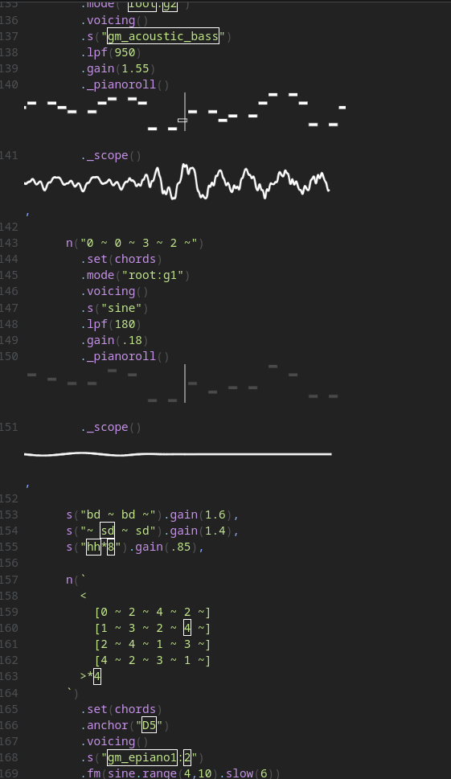

# BLUE HOUR

**A dreamy psychedelic song, made with Strudel.**

Inspired by the legendary Tame Impala. I wanted to make a dreamy psychedelic song and I think I succeeded. One of my best creations yet, spent a crazy amount of time on this.

[Listen Here](https://cdn.hackclub.com/01a10232-e717-7392-bf16-95ed61e7bc84/blue_hour_audio.mp4)

---

# Screenshot

# Getting Started

## Dependencies
- if you want to run this in vs-code you would need to install the strudel plugin

## Executing 
- go to strudel.cc paste the code 
- or click [Here](https://cdn.hackclub.com/01a10232-e717-7392-bf16-95ed61e7bc84/blue_hour_audio.mp4)
- or go to releases tab and download the song

## Playing on strudel 
- to play in strudel.cc just copy and paste the code from the 'song.strudel' file

# License

Why do u need a licence !?
